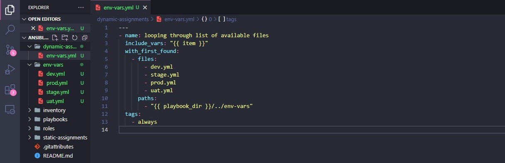
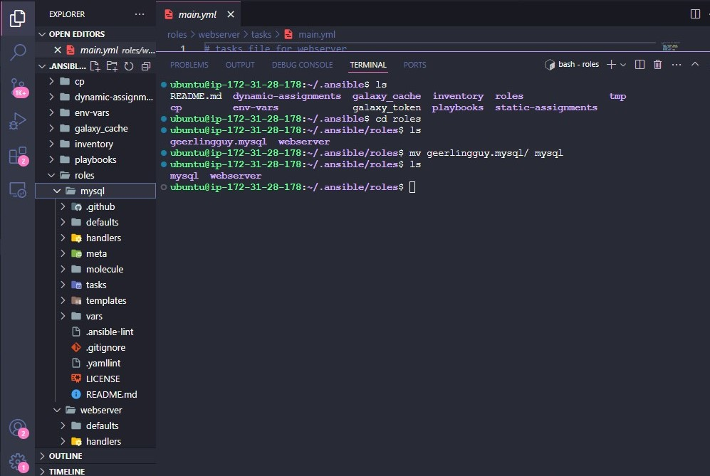
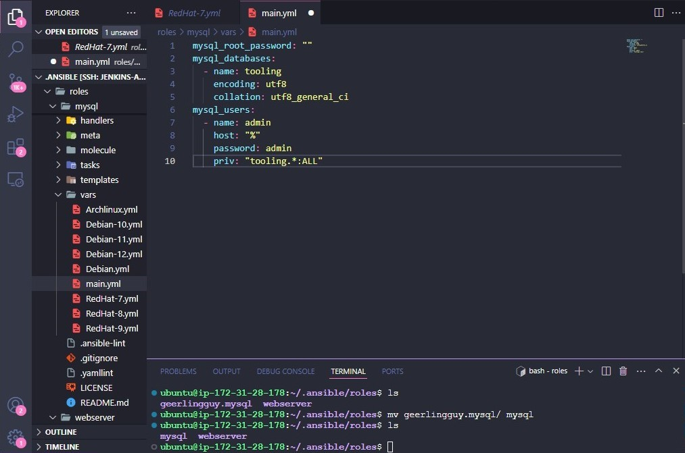
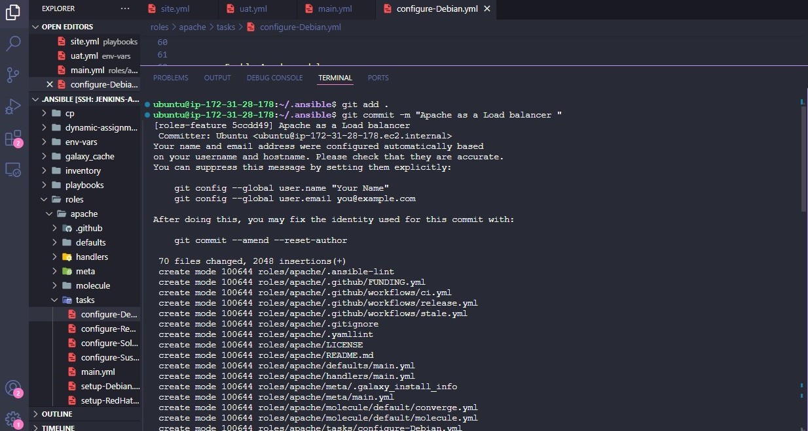
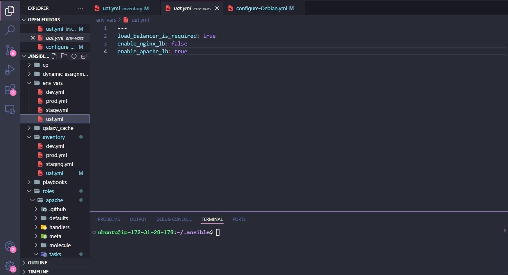
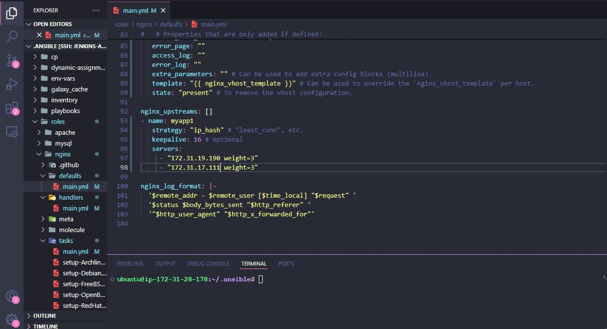
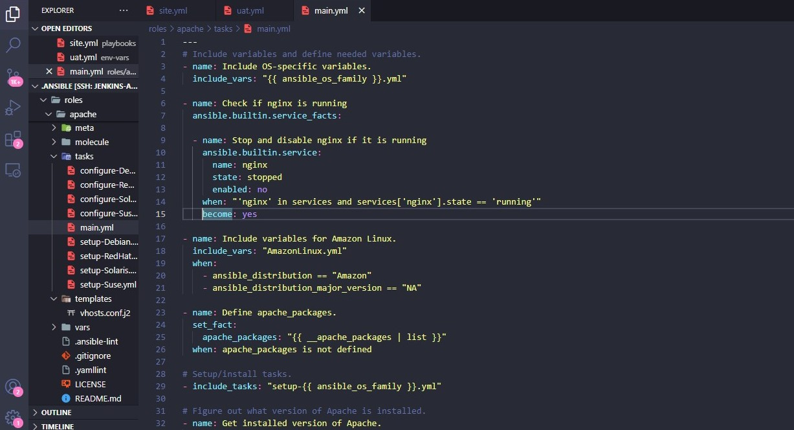
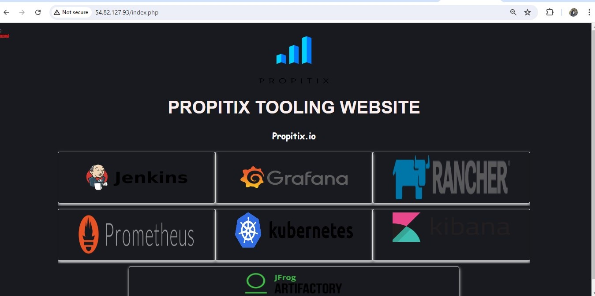

# Ansible Dynamic Assignments (Include) and Community Roles

## Project Overview

Ansible is an actively developing configuration management tool, so it is strongly recommended to always refer to the official documentation for the most up-to-date modules and usage.

👉🏾 Ansible Documentation:  
https://docs.ansible.com/

## 🧾 Project Description

This project is part of my DevOps Configuration Management learning journey using **Ansible**. It builds on previous knowledge of static assignments and introduces **dynamic assignments** using `include_*` modules, while also leveraging **Ansible Galaxy community roles** to automate real-world infrastructure configuration. I worked extensively with **Ansible playbooks**, **roles**, and **static assignments using import_playbook**.

In this project, I implemented:

- Dynamic environment variable loading (dev, stage, uat, prod)
- Community MySQL role installation and configuration
- Conditional Load Balancer configuration (Nginx or Apache)
- Scalable Ansible repository structure for production-like environments

---

## 🎯 Objectives

The objective of this project is to:

- Understand the difference between **static assignments** and **dynamic assignments**
- Implement dynamic assignments using `include_vars` and `include_tasks`
- Structure the repository to support multiple environments (dev, stage, uat, prod)
- Configure environment-specific variables dynamically
- Install and configure MySQL using the community role **geerlingguy.mysql**
- Configure Load Balancers using **Apache** or **Nginx** roles
- Enable switching between Nginx and Apache using conditional variables
- Automate deployment of the tooling website infrastructure using Ansible
- Improve repository modularity, readability, and scalability

---

## 📚 Key Concepts: Static vs Dynamic Assignments

| Feature       | Static Assignment       | Dynamic Assignment        |
| ------------- | ----------------------- | ------------------------- |
| Module Used   | `import_playbook`       | `include_*`               |
| When It Loads | During playbook parsing | During playbook execution |
| Debugging     | Easier                  | Harder                    |
| Flexibility   | Less flexible           | More flexible             |

From previous projects, static assignments were implemented using `import_playbook`.

The module that enables dynamic assignments is `include_*`.

Hence:

```bash
import = Static
include = Dynamic
```

### Static Assignment (import_playbook)

When `import_playbook` is used, all statements are pre-processed when the playbook is parsed.
This means Ansible loads everything at the beginning of execution.

### Dynamic Assignment (include_tasks / include_vars)

When `include_*` is used, playbooks and variables are loaded during runtime (execution time).
This makes it more flexible, especially for environment-specific configurations.

📌 **Note:**  
Ansible deprecated the old `include` module. Modern Ansible uses:

- `include_vars`
- `include_tasks`
- `include_role`

📌 Official reference:
[https://docs.ansible.com/ansible/latest/playbook_guide/playbooks_reuse.html#includes-dynamic-re-use](https://docs.ansible.com/ansible/latest/playbook_guide/playbooks_reuse.html#includes-dynamic-re-use)

---

# 🏗️ Project Architecture

This project uses a modular Ansible architecture where `site.yml` is the main entry point, and all other playbooks are imported or included.

## 📌 Architecture Diagram

```text
                     ┌────────────────────────────┐
                     │       Jenkins-Ansible      │
                     │(Control Node + Ansible CFG)│
                     └─────────────┬──────────────┘
                                   │
                         ansible-playbook runs
                                   │
        ┌──────────────────────────┴─────────────────────────┐
        │                                                    │
┌───────▼────────┐     ┌───────────▼──────────┐  ┌───────────▼────┐
│ UAT Webserver 1│     │  UAT Webserver 2     │  │ Load Balancer  │
│ (Apache + PHP) │     │(Apache + PHP Tooling)│  │ Nginx/Apache LB│
└────────────────┘     └──────────────────────┘  └────────────────┘
                                   │
                                   ▼
                         ┌──────────────────────┐
                         │ MySQL Database Server│
                         │ (Tooling Database)   │
                         └──────────────────────┘
```


```text
                   ┌────────────────────────────┐
                   │        site.yml            │
                   │   (Main Entry Playbook)    │
                   └─────────────┬──────────────┘
                                 │
              ┌──────────────────┴──────────────────┐
              │                                     │
   ┌──────────▼───────────┐             ┌───────────▼────────────┐
   │ Static Assignments   │             │ Dynamic Assignments    │
   │ (import_playbook)    │             │ (include_vars)         │
   └──────────┬───────────┘             └───────────┬────────────┘
              │                                     │
   ┌──────────▼───────────┐             ┌───────────▼────────────┐
   │ common.yml           │             │ env-vars.yml           │
   └──────────┬───────────┘             └───────────┬────────────┘
              │                                     │
   ┌──────────▼───────────┐             ┌───────────▼────────────┐
   │ webservers.yml       │             │ dev.yml / stage.yml    │
   └──────────┬───────────┘             │ uat.yml / prod.yml     │
              │                         └───────────┬────────────┘
              │                                     │
   ┌──────────▼───────────┐             ┌───────────▼────────────┐
   │ loadbalancers.yml    │             │ Conditional Role Logic │
   └──────────┬───────────┘             └───────────┬────────────┘
              │                                     │
   ┌──────────▼─────────────────┐
   │ Roles (mysql/nginx/apache) │
   └────────────────────────────┘
```

---

# 📂 Repository Structure

After implementing dynamic assignments and community roles, the repository structure looks like this:

```bash
ansible-config-mgt/
├── dynamic-assignments/
│   └── env-vars.yml
├── env-vars/
│   ├── dev.yml
│   ├── stage.yml
│   ├── uat.yml
│   └── prod.yml
├── inventory/
│   ├── dev.yml
│   ├── stage.yml
│   ├── uat.yml
│   └── prod.yml
├── playbooks/
│   └── site.yml
├── static-assignments/
│   ├── common.yml
│   ├── webservers.yml
│   ├── db-servers.yml
│   └── loadbalancers.yml
└── roles/
    ├── mysql/
    ├── nginx/
    ├── apache/
    └── webserver/
```

---

# 🚀 Introducing Dynamic Assignment into our Structure

## Step 1: Create a New Branch

Inside the repository, I created a new branch called `dynamic-assignments`.

```bash
git checkout -b dynamic-assignments
```

📸 **Screenshot Placeholder:** Branch created
``

---

## Step 2: Create Dynamic Assignment Folder

```bash
mkdir dynamic-assignments
touch dynamic-assignments/env-vars.yml
```

📸 **Screenshot Placeholder:** dynamic-assignments folder
``

---

## Step 3: Create Environment Variable Folder

Since Ansible will manage multiple environments, each environment requires its own variables.

```bash
mkdir env-vars
touch env-vars/dev.yml env-vars/stage.yml env-vars/uat.yml env-vars/prod.yml
```


---

## Step 4: Configure env-vars.yml for Dynamic Loading

Edit file:

📌 `dynamic-assignments/env-vars.yml`

Inside `dynamic-assignments/env-vars.yml`, I added the configuration below:

```yaml
---
- name: collate variables from env specific file, if it exists
  hosts: all
  tasks:
    - name: looping through list of available files
      include_vars: '{{ item }}'
      with_first_found:
        - files:
            - dev.yml
            - stage.yml
            - prod.yml
            - uat.yml
          paths:
            - '{{ playbook_dir }}/../env-vars'
      tags:
        - always
```

📸 **Screenshot Placeholder:** env-vars.yml content


---

### 🔍 Important Notes

- The `include` module is deprecated in modern Ansible.
- New include variants include:
  - include_role
  - include_tasks
  - include_vars

📌 Reference:
[https://docs.ansible.com/ansible/latest/reference_appendices/special_variables.html](https://docs.ansible.com/ansible/latest/reference_appendices/special_variables.html)

- `playbook_dir` helps Ansible resolve paths dynamically
- `with_first_found` ensures the first matching file is loaded

---

# 🛠️ Update site.yml with Dynamic Assignments

## Step 5: Update site.yml to Include Dynamic Assignment

Edit file:

📌 `playbooks/site.yml`

The main entry point playbook is `playbooks/site.yml`.
I updated it to include environment variables dynamically.

```yaml
---
- hosts: all
  name: Include dynamic variables
  become: yes
  tasks:
    - include_tasks: ../dynamic-assignments/env-vars.yml
      tags:
        - always

- import_playbook: ../static-assignments/common.yml

- import_playbook: ../static-assignments/webservers.yml

- import_playbook: ../static-assignments/loadbalancers.yml

- import_playbook: ../static-assignments/db-servers.yml
```

 **Updated site.yml** 


---

# 🌍 Community Roles Implementation (MySQL)

Instead of writing MySQL tasks manually, I used a community role developed by **geerlingguy**.

📌 Role Source:
[https://galaxy.ansible.com/geerlingguy/mysql](https://galaxy.ansible.com/geerlingguy/mysql)

---

## Step 6: Setup Roles Feature Branch on Jenkins-Ansible Server

```bash
git init
git pull https://github.com/<your-name>/ansible-config-mgt.git
git remote add origin https://github.com/<your-name>/ansible-config-mgt.git
git branch roles-feature
git switch roles-feature
```

**MySQL role installed output** 


---

## Step 7: Install MySQL Role

```bash
cd ansible-config-mgt
mkdir roles
cd roles
ansible-galaxy install geerlingguy.mysql
```

```bash
mv geerlingguy.mysql mysql
```

📸 **MySQL role installed output** 


---

## Step 8: Configure MySQL Role Variables (UAT)

I updated environment variables for UAT in:

📌 `env-vars/uat.yml`

```yaml
mysql_root_password: 'Admin123'

mysql_databases:
  - name: tooling
    encoding: utf8
    collation: utf8_general_ci

mysql_users:
  - name: webaccess
    host: '%'
    password: 'password'
    priv: 'tooling.*:ALL'
```

**MySQL variables** 


---

## Step 9: Create db-servers.yml Static Assignment

📌 `static-assignments/db-servers.yml`

```yaml
---
- hosts: db_servers
  become: yes
  roles:
    - mysql
```

---

## Step 10: Push MySQL Role to GitHub

```bash
git add .
git commit -m "Added MySQL community role"
git push --set-upstream origin roles-feature
```



---

# ⚖️ Creating Load Balancer Roles

For this project, I implemented both **Apache** and **Nginx** as load balancers.

---

## Step 11: Install Apache and Nginx Community Roles

```bash
ansible-galaxy role install geerlingguy.apache
mv geerlingguy.apache apache

ansible-galaxy role install geerlingguy.nginx
mv geerlingguy.nginx nginx
```

```bash
cd roles
ansible-galaxy init nginx
ansible-galaxy init apache
```


---

## Step 12: Configure Role Defaults for Conditional Variables

To prevent conflicts, I added default variables:

Edit file:

📌 `roles/nginx/defaults/main.yml`

```yaml
enable_nginx_lb: false
load_balancer_is_required: false
```

Edit file:

📌 `roles/apache/defaults/main.yml`

```yaml
enable_apache_lb: false
load_balancer_is_required: false
```

---

## Step 13: Create loadbalancers.yml Playbook

📌 `static-assignments/loadbalancers.yml`

```yaml
---
- hosts: lb
  become: yes
  roles:
    - role: nginx
      when: enable_nginx_lb | bool and load_balancer_is_required | bool
    - role: apache
      when: enable_apache_lb | bool and load_balancer_is_required | bool
```

**loadbalancers.yml**


---

## Step 14: Enable Nginx Load Balancer for UAT

Edit file:

📌 `env-vars/uat.yml`

```yaml
load_balancer_is_required: true
enable_nginx_lb: true
enable_apache_lb: false
```

📸 **Screenshot Placeholder:** UAT LB variables


---

# 🌐 Webserver Role Setup (Tooling Website Deployment)

A webserver role was configured to install:

- Apache
- PHP and extensions
- Git
- MySQL client
- Tooling website repo clone

📌 Role Path: `roles/webserver/tasks/main.yml`

📸 Screenshot Placeholder:


---

# 🧪 Running the Playbook

After configuring the inventory file:

📌 `inventory/uat.yml`

```bash
[uat-webservers]
<uat-webserver1-private-ip> ansible_user=ec2-user
<uat-webserver2-private-ip> ansible_user=ec2-user

[lb]
<loadbalancer-private-ip> ansible_user=ec2-user

[db_servers]
<db-private-ip> ansible_user=ec2-user
```

---

## Step 16: Run the Playbook

```bash
ansible-playbook -i inventory/uat.yml playbooks/site.yml
```

---

# ✅ Validation Checks

## Check Webserver Services

```bash
sudo systemctl status httpd
sudo systemctl status php-fpm
```
---

## Check Database Service

```bash
sudo systemctl status mysqld
```

---

## Check Load Balancer Service

```bash
sudo systemctl status nginx
```
---

## Confirm Website is Accessible

```text
http://<LoadBalancer-Public-IP>/index.php
```

**Tooling website loaded** 
`

---

# ⚠️ Blockers & Troubleshooting

## Blocker 1: Database Connection Timeout

### Error

```bash
ERROR 2002 (HY000): Can't connect to server
```

### Fix

- Confirm DB instance security group allows inbound port `3306`
- Ensure MySQL is running
- Ensure user permissions allow remote access

---

## Blocker 2: Nginx and Apache Port Conflict

### Error

```bash
bind() to 0.0.0.0:80 failed (98: Address already in use)
```

### Fix

Disable one LB and enable only the required one using environment variables.

---

## Blocker 3: Tooling Website Login Failed

### Fix

- Update `functions.php` with DB host and credentials
- Import tooling SQL file
- Create a tooling user

---

# 📌 Lessons Learned

- Dynamic assignments using `include_vars` improves flexibility across environments
- `with_first_found` is powerful for selecting environment-specific variables
- Community roles save time and are production-ready
- Conditional role execution prevents service conflicts
- Proper inventory grouping is critical for accurate automation
- Debugging dynamic includes can be harder, but highly scalable
- Leveraging Ansible Galaxy community roles to avoid reinventing the wheel
- Implementing conditional deployments using variables and `when`
- Improving automation flexibility by switching load balancers easily
- Understanding how modern Ansible handles deprecated modules (`include`)
- Structuring scalable Ansible repositories for multiple environments

---

# 🏁 Conclusion

This project successfully demonstrated the power of Ansible as a configuration management tool for real-world infrastructure automation. By combining **dynamic assignments**, **environment-based variable loading**, and **community roles**, I was able to build a reusable, modular, and scalable automation solution.

The implementation of conditional load balancer roles (Apache and Nginx) further enhanced the flexibility of the infrastructure and made it easier to support different deployment requirements across environments.

This project is a major milestone in my DevOps journey, also my my confidence has been strengthened in writing production-like Ansible automation workflows and reinforced the importance of reusable infrastructure automation patterns.

---

# 📌 Author

**Vivian Chiamaka Okose**
DevOps Engineer

---

# 📎 References

- [Ansible Documentation](https://docs.ansible.com/)
- [Ansible Galaxy](https://galaxy.ansible.com/)
- [Geerlingguy MySQL Role](https://galaxy.ansible.com/geerlingguy/mysql)
