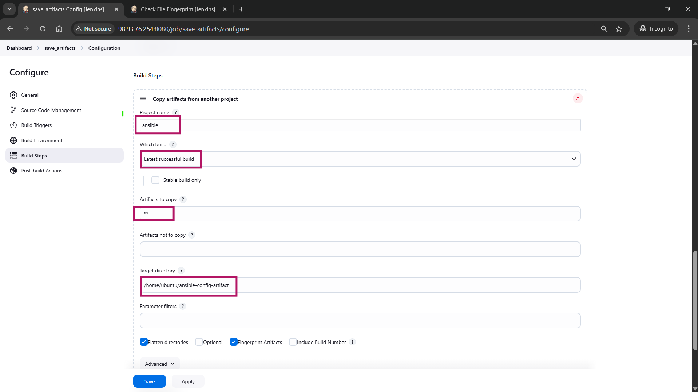
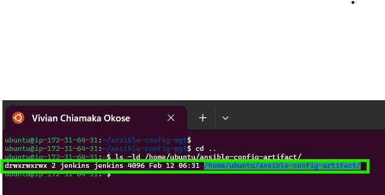
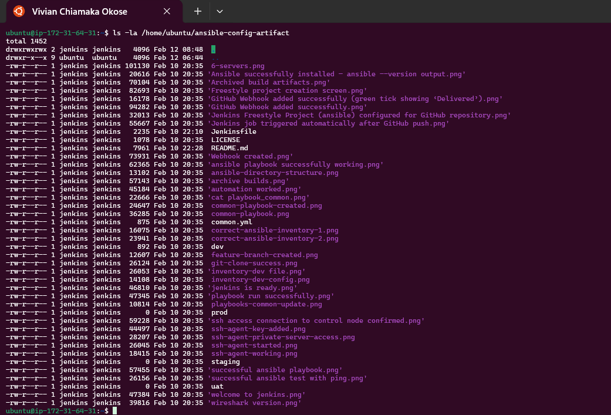
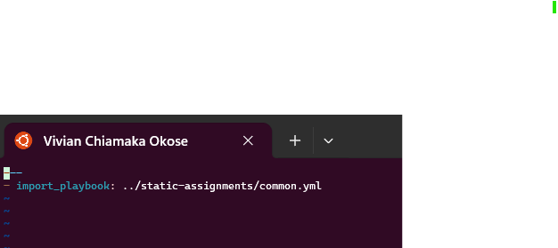
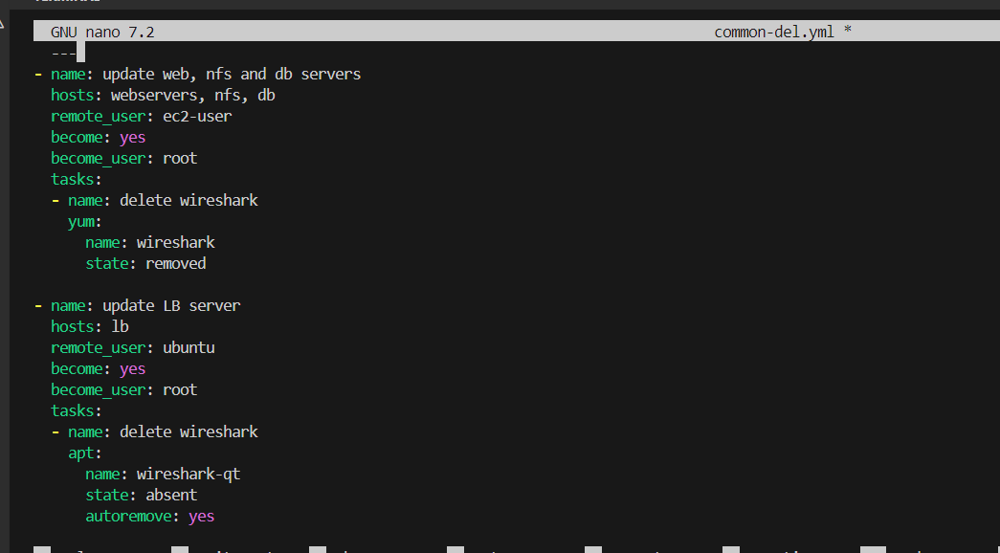
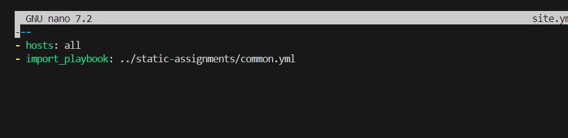
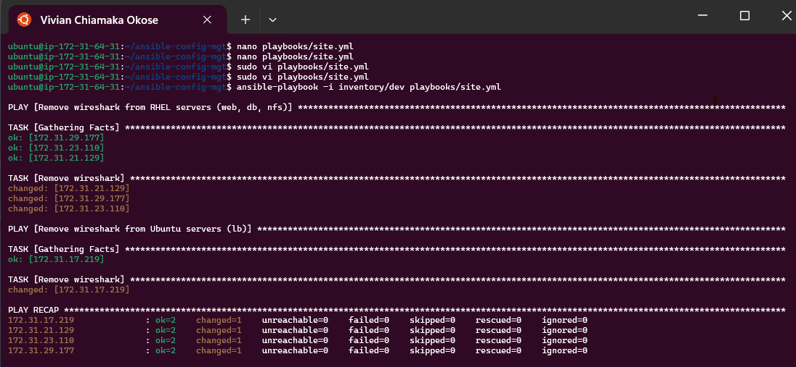
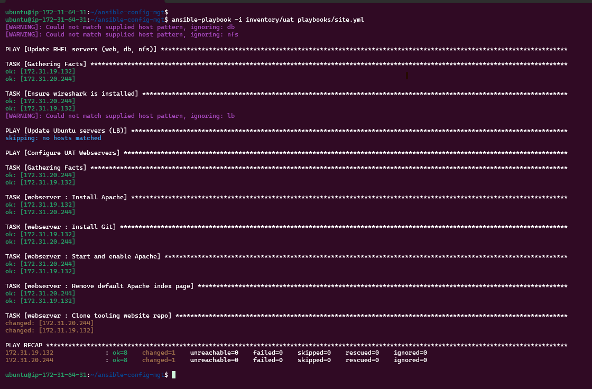

---

# Ansible Refactoring & Static Assignments (Imports and Roles)

## 📌 Project Title

**Ansible Refactoring & Static Assignments (Imports and Roles) - 101**

---

## 🎯 Objective

The goal of this project is to enhance and refactor the existing Ansible configuration management repository (`ansible-config-mgt`) by:

* Improving Jenkins artifact handling to avoid directory clutter
* Refactoring Ansible playbooks into reusable modules using **imports**
* Organizing playbooks using **static assignments**
* Deploying UAT webservers using a reusable **role**
* Ensuring the infrastructure remains consistent while improving maintainability

This project introduces **Ansible Imports and Roles**, which improves scalability, readability, and automation efficiency.

---

# ✅ Step 1: Jenkins Job Enhancement (Centralizing Artifacts)

Before refactoring our Ansible playbooks, we first improve our Jenkins workflow.

Previously, each build created a new directory which caused:

* workspace clutter
* unnecessary disk consumption
* difficulty tracking latest build artifacts

To solve this, we introduced a second Jenkins job called `save_artifacts`, which copies the output of the `ansible` job into a central folder.

---

## 1. Create Artifact Directory

SSH into the Jenkins-Ansible server and create a new directory to store artifacts:

```bash
sudo mkdir /home/ubuntu/ansible-config-artifact
```

---

## 2. Set Permissions for Jenkins Access

Give full permission so Jenkins can write into it:

```bash
sudo chmod -R 0777 /home/ubuntu/ansible-config-artifact
```

---

## 3. Install Copy Artifact Plugin

On Jenkins Dashboard:

* Manage Jenkins
* Manage Plugins
* Available tab
* Search: **Copy Artifact**
* Install without restart

---

## 4. Create a New Freestyle Job: `save_artifacts`

Create a freestyle project named:

✅ `save_artifacts`

📸 **save_artifacts job created** 


---

## 5. Configure Job Trigger

In `save_artifacts` configuration:

* Build Triggers → **Build after other projects are built**
* Project to watch: `ansible`

📸 **Build trigger configuration** 


---

## 6. Configure Copy Artifact Build Step

Under Build Steps:

* Choose: **Copy artifacts from another project**
* Source project: `ansible`
* Target directory: `/home/ubuntu/ansible-config-artifact`


📸 **Screenshot Slot:** Copy artifact build step


---

## 7. Test Setup by Modifying README.md

Edit `README.md`, commit, and push to GitHub:

```bash
git add .
git commit -m "Testing Jenkins artifact copy setup"
git push origin main
```

---

## 8. Verify Artifacts Were Copied

Check the artifact directory:

```bash
ls -l /home/ubuntu/ansible-config-artifact
```

📸 **Copy artifact build step** 

---

## 🛑 Troubleshooting Permission Denied Issue

During the test build, the Jenkins job failed with:

```bash
java.nio.file.AccessDeniedException: /home/ubuntu/ansible-config-artifact
```

This error occurred because Jenkins lacked permission to write into `/home/ubuntu`.

To fix it, we ensured Jenkins had proper ownership:

```bash
sudo chown -R jenkins:jenkins /home/ubuntu/ansible-config-artifact
sudo chmod -R 775 /home/ubuntu/ansible-config-artifact
```

We also ensured `/home/ubuntu` had executable permission:

```bash
sudo chmod 755 /home/ubuntu
```

Restart Jenkins:

```bash
sudo systemctl restart jenkins
```

📸 **Screenshot Slot:** Jenkins permission fix applied


---

# ✅ Step 2: Refactor Ansible Code Using Imports (`site.yml`)

Refactoring improves maintainability and makes playbooks reusable.

Instead of writing everything inside one playbook (`common.yml`), we restructure our project so that:

* `site.yml` becomes the main entry point
* other playbooks are imported as child assignments

---

## 1. Pull Latest Main Branch and Create New Branch

```bash
git checkout main
git pull origin main
git checkout -b refactor
```

---

## 2. Create `site.yml` Entry Point

Inside `playbooks/`, create a new file:

```bash
touch playbooks/site.yml
```

---

## 3. Create Static Assignments Folder

At repository root:

```bash
mkdir static-assignments
```

---

## 4. Move `common.yml` Into static-assignments

```bash
mv playbooks/common.yml static-assignments/
```

---

## 5. Import common.yml into site.yml

Edit `playbooks/site.yml`:

```yaml
---
- hosts: all
- import_playbook: ../static-assignments/common.yml
```

📸 **site.yml import common.yml** 


---

## 6. Confirm New Directory Structure

Expected structure:

```
├── static-assignments
│   └── common.yml
├── inventory
│   ├── dev.yml
│   ├── stage.yml
│   ├── uat.yml
│   └── prod.yml
└── playbooks
    └── site.yml
```

---

# ✅ Step 2B: Create common-del.yml (Test Import Reusability)

To validate our imports system, we created a playbook to remove Wireshark from servers.

---

## 1. Create common-del.yml

Inside static-assignments:

```bash
touch static-assignments/common-del.yml
```

---

## 2. Add Wireshark Removal Tasks

```yaml
---
- name: update web, nfs and db servers
  hosts: webservers, nfs, db
  remote_user: ec2-user
  become: yes
  tasks:
    - name: delete wireshark
      yum:
        name: wireshark
        state: removed

- name: update LB server
  hosts: lb
  remote_user: ubuntu
  become: yes
  tasks:
    - name: delete wireshark
      apt:
        name: wireshark
        state: absent
        autoremove: yes
        purge: yes
        autoclean: yes
```

📸 **common-del.yml content** 


---

## 3. Update site.yml to Import common-del.yml

```yaml
---
- hosts: all
- import_playbook: ../static-assignments/common-del.yml
```

📸 **Screenshot Slot:** site.yml updated for deletion


---

## 4. Run Playbook Against Dev Inventory

```bash
ansible-playbook -i inventory/dev.yml playbooks/site.yml
```

📸 **Playbook run output** 


---

## 5. Verify Wireshark Was Removed

On each server:

```bash
wireshark --version
```

---

# ✅ Step 3: Configure UAT Webservers Using a Role (`webserver`)

To avoid repeating tasks and to keep the code modular, we configured UAT webservers using an Ansible role.

---

## 1. Launch Two RHEL UAT Instances

We launched 2 fresh EC2 instances:

* Web1-UAT
* Web2-UAT

---

## 2. Create Roles Directory and Initialize Webserver Role

```bash
mkdir roles
cd roles
ansible-galaxy init webserver
```

---

## 3. Clean Up Role Folder Structure

After removing unnecessary directories, structure became:

```
roles/webserver/
├── README.md
├── defaults/main.yml
├── handlers/main.yml
├── meta/main.yml
├── tasks/main.yml
└── templates/
```

---

## 4. Update Inventory File `uat.yml`

Edit:

`inventory/uat.yml`

```ini
[uat-webservers]
<Web1-UAT-Private-IP> ansible_ssh_user='ec2-user'
<Web2-UAT-Private-IP> ansible_ssh_user='ec2-user'
```

---

## 5. Configure roles_path in Ansible Config

Edit:

`/etc/ansible/ansible.cfg`

Uncomment:

```ini
roles_path = /home/ubuntu/ansible-config-mgt/roles
```

---

## 6. Add Webserver Role Tasks

Edit:

`roles/webserver/tasks/main.yml`

```yaml
---
- name: install apache
  become: true
  ansible.builtin.yum:
    name: httpd
    state: present

- name: install git
  become: true
  ansible.builtin.yum:
    name: git
    state: present

- name: clone tooling repo
  become: true
  ansible.builtin.git:
    repo: https://github.com/vivianokose/tooling.git
    dest: /var/www/html
    force: yes

- name: copy html content to one level up
  become: true
  command: cp -r /var/www/html/html/ /var/www/

- name: start httpd service
  become: true
  ansible.builtin.service:
    name: httpd
    state: started

- name: remove html directory
  become: true
  ansible.builtin.file:
    path: /var/www/html/html
    state: absent
```

---

# ✅ Step 4: Reference the Webserver Role in Static Assignment

Now we create a playbook that assigns the role to UAT webservers.

---

## 1. Create uat-webservers.yml

Inside `static-assignments`:

```bash
touch static-assignments/uat-webservers.yml
```

Add:

```yaml
---
- hosts: uat-webservers
  roles:
    - webserver
```

---

## 2. Import uat-webservers.yml in site.yml

Edit `playbooks/site.yml`:

```yaml
---
- hosts: all
- import_playbook: ../static-assignments/common.yml

- hosts: uat-webservers
- import_playbook: ../static-assignments/uat-webservers.yml
```

---

# ✅ Step 5: Commit, Push, PR Merge & Run Deployment

At this stage, all configurations are complete and ready for deployment.

---

## 1. Commit and Push Changes

```bash
git add .
git commit -m "Refactored playbooks and added webserver role for UAT"
git push origin refactor
```

---

## 2. Create Pull Request and Merge into Main

On GitHub:

* Open PR from `refactor` → `main`
* Merge changes

---

## 3. Verify Jenkins Jobs Ran Successfully

Ensure:

* `ansible` job ran successfully
* `save_artifacts` ran successfully

📸 **Screenshot Slot:** Jenkins job success


---

## 4. Verify Artifacts Saved

```bash
ls -l /home/ubuntu/ansible-config-artifact
```

---

## 5. Run Playbook Against UAT

Navigate:

```bash
cd /home/ubuntu/ansible-config-artifact
```

Run:

```bash
ansible-playbook -i inventory/uat.yml playbooks/site.yml
```

📸 **Screenshot Slot:** playbook execution output


---

# ✅ Step 6: Verify Deployment in Browser

Now confirm the tooling website is accessible.

Visit:

```
http://<Web1-UAT-Public-IP>/index.php
```

Visit:

```
http://<Web2-UAT-Public-IP>/index.php
```

---

# Project Folder Structure (Final View)

Final structure:

```
ansible-config-mgt/
├── inventory/
│   ├── dev.yml
│   ├── stage.yml
│   ├── uat.yml
│   └── prod.yml
├── playbooks/
│   └── site.yml
├── static-assignments/
│   ├── common.yml
│   ├── common-del.yml
│   └── uat-webservers.yml
├── roles/
│   └── webserver/
│       ├── tasks/main.yml
│       ├── defaults/main.yml
│       ├── handlers/main.yml
│       ├── meta/main.yml
│       └── templates/
└── README.md
```

---

# Outcome / Deliverables

By the end of this project, we successfully achieved:

✅ Jenkins pipeline improved using centralized artifact storage
✅ Copy Artifact plugin configured successfully
✅ Ansible playbooks refactored using import_playbook
✅ static-assignments directory created for modular playbooks
✅ Webserver role created and referenced properly
✅ UAT webservers automatically deployed with tooling website
✅ Apache installed, started and running
✅ Tooling repo cloned automatically
✅ UAT servers accessible via browser

---

# Key DevOps Skills Demonstrated

This project strengthened key DevOps skills such as:

* Jenkins automation & artifact management
* Git branching and pull request workflow
* Infrastructure modularization using Ansible imports
* Role-based configuration management
* Automated deployment to multiple servers
* Troubleshooting permissions and Jenkins pipeline failures

---

# Lessons Learned

* Refactoring improves maintainability and reduces repetition
* `site.yml` is a scalable entry point for infrastructure automation
* Static assignments allow modular playbook organization
* Roles make configurations reusable across environments
* Jenkins requires correct permission handling for directory writes

---

# Conclusion

This project demonstrates a real-world DevOps improvement approach by enhancing an existing Ansible codebase without changing infrastructure behavior. By introducing modular playbooks, static assignments, and roles, we achieved a scalable configuration management system.

Additionally, the Jenkins pipeline was optimized using artifact centralization, ensuring that each build output is neatly stored and updated without creating unnecessary workspace clutter.

With this setup, future infrastructure updates become easier, cleaner, and faster to manage.

---