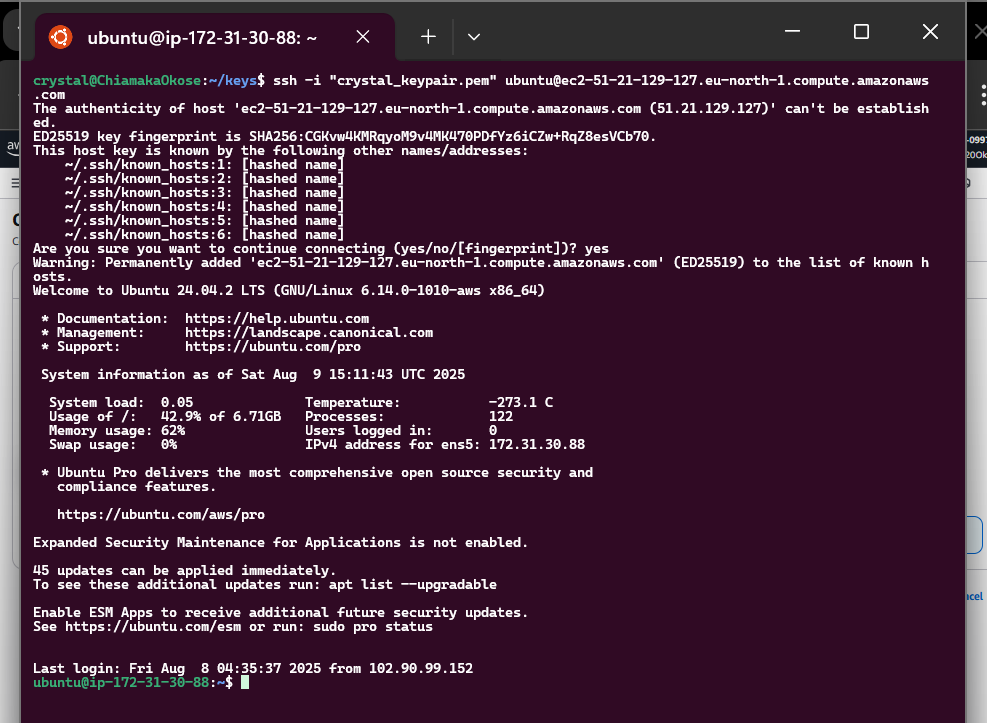
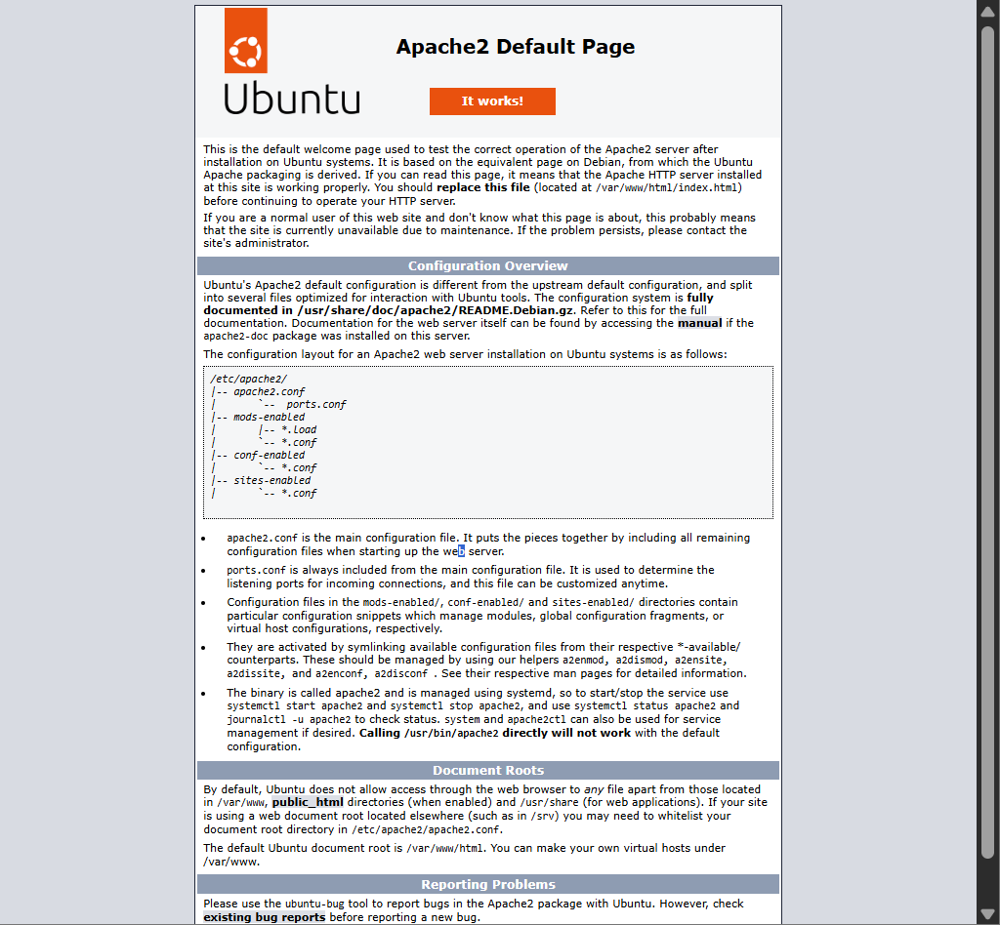
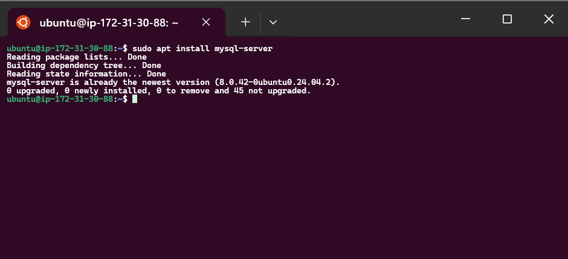
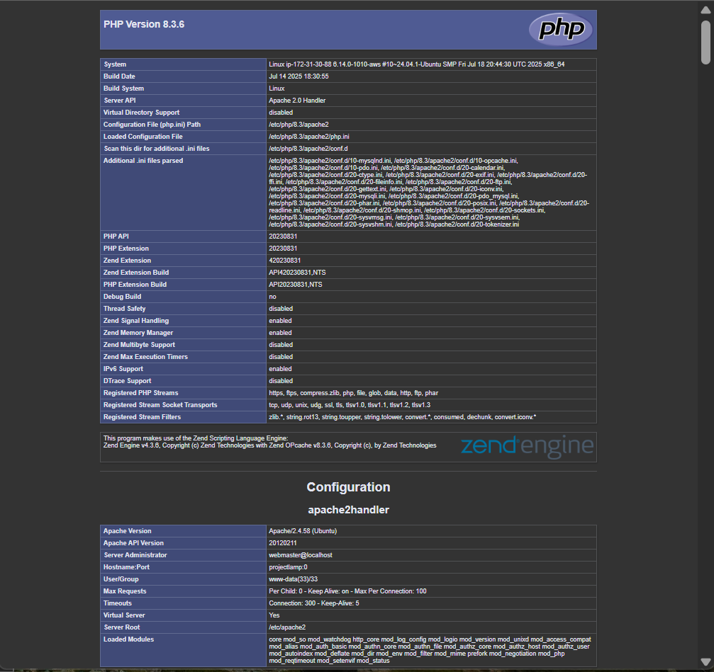

# WEB STACK IMPLEMENTATION (LAMP STACK) IN AWS

## Introduction

The **LAMP stack** is a widely used web development platform that is open-source and made up of four core components:

- **Linux** – Operating System
- **Apache** – Web Server
- **MySQL** – Database
- **PHP** – Programming Language (sometimes Perl or Python)

This guide will walk you through **setting up, configuring, and using the LAMP stack** on AWS.

---

## Step 0: Getting Ready

We start by preparing the environment (Linux OS) that will host and serve our website.

### 1. Launch an EC2 Instance

- Choose **t2.micro** with **Ubuntu 24.04 LTS** in a region closest to you.
- Example used here: `eu-west-2a`

**[Screenshot: Launch EC2 Instance]**  


### 2. Create an SSH Key Pair

- This will be used to securely connect to your EC2 instance via **Port 22**.

### 3. Configure Security Group Inbound Rules

Allow:

- **HTTP (80)** from anywhere
- **HTTPS (443)** from anywhere
- **SSH (22)** from anywhere _(default)_

**[Screenshot: Security Group Rules]**  
``

### 4. Select the Correct VPC

- For this tutorial, we used the **default VPC**.

### 5. Connect to EC2 Instance

Use the private key you downloaded:

```bash
ssh -i "your-ec2-key.pem" ubuntu@<51.21.129.127>
```

> Replace `<51.21.129.127>` with your instance’s IP.  
> IP changes after a reboot unless using an **Elastic IP**.

**[Screenshot: SSH Connection]**  


---

## Step 1 – Install Apache and Configure Firewall

1. **Update and Upgrade Packages**

```bash
sudo apt update
sudo apt upgrade -y
```

2. **Install Apache**

```bash
sudo apt install apache2 -y
```

3. **Enable Apache and Check Status**

```bash
sudo systemctl enable apache2
sudo systemctl status apache2
```

**[Screenshot: Apache Status]**  


4. **Test Local Access**

```bash
curl http://localhost:80
```

5. **Test Public Access**
   Visit:

```
http://51.21.129.127:80
```

**[Screenshot: Apache Default Page]**  


---

## Step 2 – Install MySQL

1. **Install MySQL Server**

```bash
sudo apt install mysql-server
```

2. **Enable and Start MySQL**

```bash
sudo systemctl enable --now mysql
sudo systemctl status mysql
```

3. **Log into MySQL**

```bash
sudo mysql
```

4. **Set Root Password**

```sql
ALTER USER 'root'@'localhost' IDENTIFIED WITH mysql_native_password BY 'PassW0RD$';
```

5. **Secure MySQL Installation**

```bash
sudo mysql_secure_installation
```

6. **Test MySQL Login**

```bash
sudo mysql -p
```

**[Screenshot: MySQL Login]**  


---

## Step 3 – Install PHP

1. **Install PHP and Modules**

```bash
sudo apt install php libapache2-mod-php php-mysql
```

2. **Check PHP Version**

```bash
php -v
```

---

## Step 4 – Create a Virtual Host

1. **Create Document Root**

```bash
sudo mkdir /var/www/my_project_lamp
sudo chown -R $USER:$USER /var/www/my_project_lamp
```

2. **Create Virtual Host Config**

```bash
sudo vim /etc/apache2/sites-available/my_project_lamp.conf
```

Paste:

```apache
<VirtualHost *:80>
    ServerName my_project_lamp
    ServerAlias www.myprojectlamp
    ServerAdmin webmaster@localhost
    DocumentRoot /var/www/my_project_lamp
    ErrorLog ${APACHE_LOG_DIR}/error.log
    CustomLog ${APACHE_LOG_DIR}/access.log combined
</VirtualHost>
```

3. **Enable New Site and Disable Default**

```bash
sudo a2ensite my_project_lamp
sudo a2dissite 000-default
```

4. **Check Config and Reload Apache**

```bash
sudo apache2ctl configtest
sudo systemctl reload apache2
```

5. **Create Test HTML File**

```bash
echo "<h1>Hello LAMP</h1>" | sudo tee /var/www/my_project_lamp/index.html
```

---

## Step 5 – Enable PHP on the Website

1. **Change Directory Index Priority**

```bash
sudo vim /etc/apache2/mods-enabled/dir.conf
```

Change:

```apache
DirectoryIndex index.php index.html index.cgi index.pl index.xhtml index.htm
```

2. **Reload Apache**

```bash
sudo systemctl reload apache2
```

3. **Create PHP Test File**

```bash
sudo vim /var/www/my_project_lamp/index.php
```

Paste:

```php
<?php
phpinfo();
?>
```

4. **Access PHP Info Page**

```
http://51.21.129.127:80
```

**[Screenshot: PHP Info Page]**  


5. **Remove Test File (For Security)**

```bash
sudo rm /var/www/my_project_lamp/index.php
```

---

## Conclusion

The **LAMP stack** is a robust, flexible, and widely supported environment for hosting web applications.  
Following the steps above, you have successfully:

- Launched an AWS EC2 instance
- Installed and configured Apache, MySQL, and PHP
- Set up a virtual host
- Tested the server with HTML and PHP

You now have a functioning LAMP environment ready for your web projects.

---
