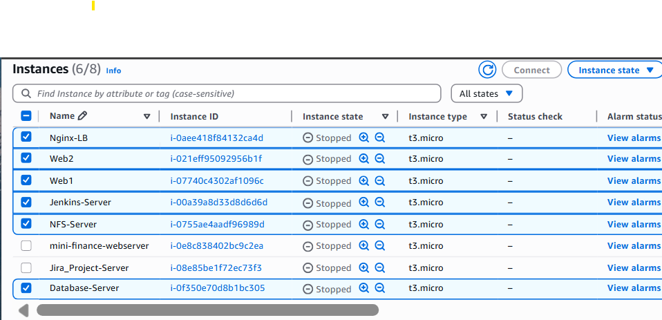

# Ansible Configuration Management with Jenkins

## Project Overview

This project demonstrates **infrastructure automation and configuration management** using **Ansible**, **Jenkins**, and **Git** on **AWS EC2** instances.

The goal is to showcase how a **Jenkins-Ansible (Jump/Bastion) server** can centrally manage and automate configurations across multiple Linux servers using **Infrastructure as Code (IaC)** principles.

This repository was built as part of a hands-on DevOps assignment and structured to reflect **real-world DevOps workflows** recruiters expect to see.

---

## 🧱 Architecture Overview

```
                 ┌────────────────────┐
                 │ Jenkins-Ansible    │
                 │ (Ubuntu)           │
                 │ - Jenkins          │
                 │ - Ansible          │
                 └─────────┬──────────┘
                           │ SSH (Agent Forwarding)
        ┌──────────────────┼──────────────────┐
        │                  │                  │
┌──────────────┐   ┌──────────────┐   ┌──────────────┐
│ Web Servers  │   │ NFS Server   │   │ DB Server    │
│ RHEL         │   │ RHEL         │   │ RHEL         │
└──────────────┘   └──────────────┘   └──────────────┘
                           │
                    ┌──────────────┐
                    │ Load Balancer│
                    │ Ubuntu       │
                    └──────────────┘
```

---

## 🖥️ Server Inventory

| Server          | OS     | Public IP | Purpose                          |
| --------------- | ------ | --------- | --------------------------------- |
| Jenkins-Ansible | Ubuntu | ✅ Yes    | Ansible control & Jenkins server |
| Web Servers     | RHEL   | ❌ No    | Managed by Ansible               |
| NFS Server      | RHEL   | ❌ No    | Managed by Ansible               |
| DB Server       | RHEL   | ❌ No    | Managed by Ansible               |
| Load Balancer   | Ubuntu | ❌ No    | Managed by Ansible               |

> 🔹 Public IPs were intentionally enabled for all servers in this beginner project to reduce networking complexity and focus on **Ansible fundamentals**.

---

## 🧰 Tools & Technologies

* **AWS EC2** – Infrastructure
* **Ubuntu & RHEL** – Operating Systems
* **Ansible** – Configuration Management
* **Jenkins** – CI/CD Automation
* **Git & GitHub** – Version Control
* **SSH Agent Forwarding** – Secure remote access

---

## 📂 Repository Structure

```
ansible-config-mgt/
├── inventory/
│   ├── dev
│   ├── staging
│   ├── uat
│   └── prod
├── playbooks/
│   └── common.yml
└── README.md
```

📸 **Screenshot:** Repository structure (`ls -R`)

---

## 🔄 Project Phases

### Phase 1 – AWS Setup

* Provisioned EC2 instances
* Configured security groups (SSH & Jenkins access)

📸 **Screenshot:** EC2 instances dashboard


---

### Phase 2 – Ansible Installation

**Server:** Jenkins-Ansible

```bash
sudo apt update
sudo apt install ansible -y
ansible --version
```

📸 **Screenshot:** Ansible version output


---

### Phase 3 – Jenkins Integration

* Created Jenkins freestyle job
* Connected GitHub repository
* Enabled webhook-triggered builds
* Archived build artifacts

📸 Screenshots:
%20configured%20for%20GitHub%20repository.png)


* Jenkins job configuration
* Successful Jenkins build
* Archived artifacts directory

---

### Phase 4 – Inventory Configuration

**Server:** Jenkins-Ansible

```ini
[webservers]
172.31.23.110 ansible_ssh_user=ec2-user ansible_ssh_private_key_file=/home/ubuntu/steghub-keypair.pem
172.31.26.234 ansible_ssh_user=ec2-user ansible_ssh_private_key_file=/home/ubuntu/steghub-keypair.pem

[nfs]
172.31.29.177 ansible_ssh_user=ec2-user ansible_ssh_private_key_file=/home/ubuntu/steghub-keypair.pem

[db]
172.31.21.129 ansible_ssh_user=ec2-user ansible_ssh_private_key_file=/home/ubuntu/steghub-keypair.pem

[lb]
172.31.17.219 ansible_ssh_user=ubuntu ansible_ssh_private_key_file=/home/ubuntu/steghub-keypair.pem
```

> Private IPs are used internally althrough the private instances/servers.

---

### Phase 5 – Common Ansible Playbook

```yaml
---
- name: Configure RHEL servers
  hosts: webservers, nfs, db
  become: yes
  tasks:
    - name: Install Wireshark
      yum:
        name: wireshark
        state: latest

- name: Configure Load Balancer
  hosts: lb
  become: yes
  tasks:
    - name: Update apt cache
      apt:
        update_cache: yes

    - name: Install Wireshark
      apt:
        name: wireshark
        state: latest
```

---

### Phase 6 – Git Workflow

```bash
git checkout -b feature/common-playbook
git add .
git commit -m "Add common ansible playbook"
git push origin feature/common-playbook
```

* Opened Pull Request
* Merged into `main`
* Jenkins triggered automatically

📸 Screenshots:


* Pull Request
* Merge confirmation
* Jenkins build

---

### Phase 7 – Ansible Execution

**Server:** Jenkins-Ansible

```bash
ansible-playbook -i inventory/dev playbooks/common.yml
```

✅ All hosts configured successfully

Verification:

```bash
which wireshark || wireshark --version
```

📸 Screenshot: Successful Ansible run


---

## 🧠 Lessons Learned

* The importance of **matching Ansible modules to OS families** (`apt` vs `yum`)
* Why **SSH agent forwarding** is critical for multi-host automation
* How Jenkins integrates seamlessly with Git for **infrastructure CI/CD**
* Debugging Ansible errors methodically (connectivity, permissions, dependencies)
* Writing **clear documentation** is as important as writing automation code

---

## 🚧 Future Improvements

* Refactor playbooks into **Ansible roles**
* Implement **dynamic inventory** using AWS EC2 plugin
* Restrict servers to **private subnets with NAT Gateway**
* Add **Ansible Vault** for secrets management
* Extend Jenkins pipeline using **Declarative Pipelines (Jenkinsfile)**

---

## 👤 Author

**Vivian Chiamaka Okose**  
Cloud DevOps Engineer | Automation Enthusiast

📧 Email: vivianokose@gmail.com  
💼 LinkedIn: [linkedin.com/in/okosechiamaka](https://www.lhttps://www.linkedin.com/in/okosechiamaka/)  
🐙 GitHub: [github.com/vivianokose](https://github.com/vivianokose)
---

## 🏁 Conclusion

This project demonstrates a solid foundation in **Ansible-driven automation**, **CI/CD integration**, and **DevOps best practices**. It reflects real-world workflows and serves as a strong portfolio piece for junior-to-mid level DevOps roles.
