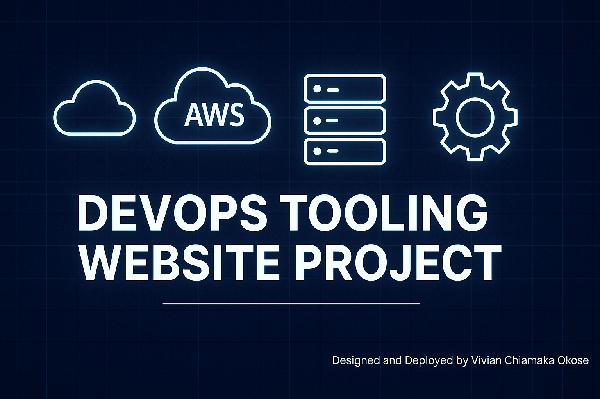
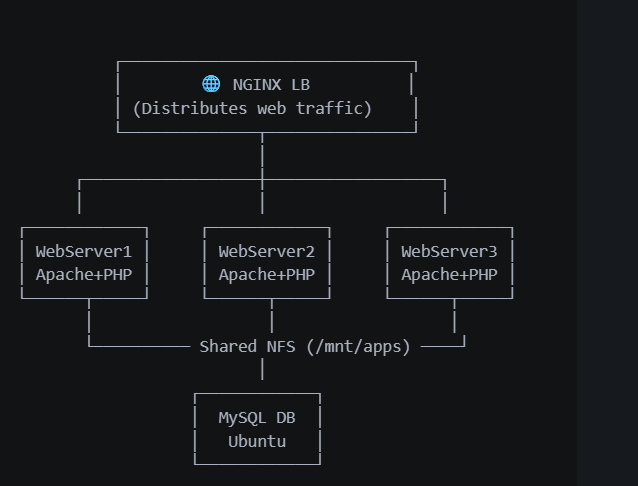

<!-- Banner -->
<p align="center">
  
</p>

# 🧰 DevOps Tooling Website Deployment Project (End-to-End on AWS)

This project demonstrates a complete **DevOps website deployment solution**  from setting up servers to configuring a load balancer, database, shared storage, and troubleshooting real-world errors, all hosted on **AWS EC2 instances**.

It replicates a realistic multi-tier architecture setup used in production environments, providing practical experience in **Linux administration**, **web server setup**, **load balancing**, **NFS storage**, **database configuration**, and **DevOps troubleshooting**.

---

## ✨ Project Highlights

- ⚙️ Provisioned and configured multiple **AWS EC2 instances** for Web, NFS, DB, and Load Balancer tiers.  
- 📦 Set up **NFS shared storage** to enable centralized file management for web servers.  
- 🖥️ Configured **Apache** and **PHP** on three web servers with access to a common NFS share.  
- 🧠 Implemented **MySQL database** on a dedicated DB server and linked it to the web application.  
- 🔁 Set up **NGINX Load Balancer** to distribute traffic evenly across web servers.  
- 🧩 Resolved issues such as `HTTP ERROR 500`, SELinux restrictions, and NFS busy mounts.  
- ✅ Validated successful deployment via the **load balancer public IP** with working login page.  

---

## 📚 Table of Contents

1. [Project Overview](#-project-overview)
2. [Architecture Diagram](#-architecture-diagram)
3. [Technologies Used](#-technologies-used)
4. [Phase 1 – Infrastructure Setup](#-phase-1--infrastructure-setup)
5. [Phase 2 – NFS Server Configuration](#-phase-2--nfs-server-configuration)
6. [Phase 3 – Web Server Configuration](#-phase-3--web-server-configuration)
7. [Phase 4 – Database Server Configuration](#-phase-4--database-server-configuration)
8. [Phase 5 – Load Balancer Configuration](#-phase-5--load-balancer-configuration)
9. [Issues & Fixes](#-issues--fixes)
10. [Verification & Testing](#-verification--testing)
11. [Conclusion](#-conclusion)
12. [Author & Contact](#-author--contact)

---

## 🏗️ Project Overview

The **DevOps Tooling Website** project focuses on deploying a PHP-based web application using an N-tier architecture consisting of:

- **3 Web Servers** (Apache + PHP)
- **1 NFS Server** (for shared storage)
- **1 Database Server** (MySQL)
- **1 Load Balancer** (NGINX)

Each component was hosted on separate AWS EC2 instances within the same VPC for connectivity.

---

## 🧭 Architecture Diagram


*Diagram showing Load Balancer → 3 Web Servers → NFS + DB connections.*

---

## 🧰 Technologies Used

| Category | Tools/Technologies |
|-----------|--------------------|
| Cloud Provider | AWS EC2 |
| Web Server | Apache HTTP Server |
| Load Balancer | NGINX |
| Database | MySQL 8 |
| Shared Storage | NFS (Network File System) |
| Scripting | Bash |
| OS | Red Hat Enterprise Linux (RHEL) / Ubuntu |
| Language | PHP |
| Version Control | Git & GitHub |

---

## 🧩 Phase 1 – Infrastructure Setup

### 🪜 Steps
1. Launched six EC2 instances on AWS:
   - **Webserver1, Webserver2, Webserver3**
   - **NFS Server**
   - **Database Server**
   - **Load Balancer**
2. Configured **security groups**:
   - Webservers → allow HTTP (80), NFS, and DB access.
   - DB server → allow MySQL (3306) from Web servers.
   - NFS → allow NFS ports from Web servers.
   - Load Balancer → allow HTTP (80) to the world.


---

## 🧩 Phase 2 – NFS Server Configuration

### ⚙️ Steps
```bash
sudo dnf install nfs-utils -y
sudo mkdir -p /mnt/apps
sudo chown -R nobody: /mnt/apps
sudo chmod -R 777 /mnt/apps
sudo vi /etc/exports
```

**/etc/exports content:**
```
/mnt/apps *(rw,sync,no_root_squash,no_all_squash)
```

```bash
sudo systemctl enable --now nfs-server
sudo exportfs -r
sudo systemctl status nfs-server
```


✅ **Verified NFS Export:**
```bash
showmount -e
Export list for nfs-server:
/mnt/apps *
```

---

## 🧩 Phase 3 – Web Server Configuration

### 🧩 Step 1: Install Apache & PHP
```bash
sudo dnf install httpd php php-mysqlnd php-fpm -y
sudo systemctl enable --now httpd
```

### 🧩 Step 2: Mount NFS Share
```bash
sudo mkdir -p /var/www
sudo mount -t nfs -o rw,nosuid 172.31.19.158:/mnt/apps /var/www
```

⚠️ *Issue Encountered:*  
`umount.nfs4: /var/www: device is busy`  
✅ **Fix:**  
Use `sudo fuser -km /var/www` to kill processes and retry.

### 🧩 Step 3: Deploy Application Files
```bash
cd /var/www/html
git clone https://github.com/darey-io/tooling.git .
```

### 🧩 Step 4: Update Database Connection
`sudo vi /var/www/html/functions.php`
```php
$servername = "172.31.19.191";
$username = "webaccess";
$password = "password123";
$dbname = "tooling";
```


### 🧩 Step 5: Fix PHP 500 Error
- Enabled `display_errors = On` in `/etc/php.ini`
- Restarted Apache:  
  `sudo systemctl restart httpd`

✅ *Verified PHP:*  
`http://<WebServerPublicIP>/test.php`


---

## 🧩 Phase 4 – Database Server Configuration

### 🧩 Step 1: Install MySQL
```bash
sudo apt install mysql-server -y
sudo systemctl enable --now mysql
```

### 🧩 Step 2: Create DB and User
```bash
sudo mysql
CREATE DATABASE tooling;
CREATE USER 'webaccess'@'%' IDENTIFIED BY 'password123';
GRANT ALL PRIVILEGES ON tooling.* TO 'webaccess'@'%';
FLUSH PRIVILEGES;
```

`

✅ Confirmed Data:
```bash
SELECT * FROM users;
```

| id | username | email | user_type | status |
|----|-----------|--------|------------|--------|
| 1 | admin | admin@steghub.com | admin | 1 |

---

## 🧩 Phase 5 – Load Balancer Configuration

### 🧩 Step 1: Install NGINX
```bash
sudo dnf install nginx -y
```

### 🧩 Step 2: Configure Load Balancer
`sudo vi /etc/nginx/nginx.conf`

```nginx
upstream tooling_web {
    server 172.31.19.252;
    server 172.31.30.68;
    server 172.31.31.154;
}

server {
    listen 80;
    location / {
        proxy_pass http://tooling_web;
        proxy_set_header Host $host;
        proxy_set_header X-Real-IP $remote_addr;
        proxy_set_header X-Forwarded-For $proxy_add_x_forwarded_for;
    }
}
```

✅ **Verify Configuration**
```bash
sudo nginx -t
sudo systemctl restart nginx
```


---

## 🐞 Issues & Fixes

| Issue | Description | Solution |
|--------|--------------|-----------|
| ❌ HTTP 500 Error | PHP misconfiguration | Enabled `display_errors`, restarted Apache |
| 🔒 Permission Denied | SELinux blocking web root | `sudo setenforce 0` |
| 📦 Device Busy | NFS unmount failure | Used `fuser -km /var/www` |
| ⚠️ MySQL Connection | Wrong credentials or host | Corrected `functions.php` values |

📸 *Screenshot:* ``

---

## 🧾 Verification & Testing

✅ Accessed **Load Balancer Public IP** → Displayed login page.  
✅ Verified user authentication connected to DB.  
✅ Confirmed app files are accessible via shared NFS storage.  
✅ Checked `/var/log/nginx/access.log` for successful HTTP requests.


---

## 🎯 Conclusion

This project demonstrated a **complete multi-tier web solution** deployed using AWS infrastructure.  
It showcases real-world DevOps skills in:
- Infrastructure provisioning
- Web, DB, and load balancer configuration
- Troubleshooting Linux servers
- Collaborative project structure and documentation

---

## 👩🏽‍💻 Author & Contact

**👩🏽 Vivian Chiamaka Okose**  
📧 [vivianokose@gmail.com](mailto:vivianokose@gmail.com)  
🐙 [GitHub – vivianokose](https://github.com/vivianokose)  
🔗 [LinkedIn – Okose Chiamaka Vivian](https://www.linkedin.com/in/okosechiamaka/)

---