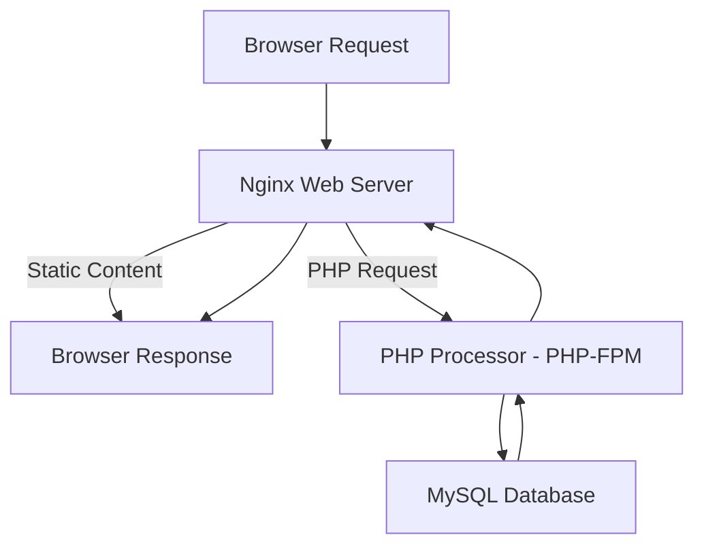

---

````markdown
# WEB STACK IMPLEMENTATION (LEMP STACK)

## 📖 Introduction
The **LEMP stack** (Linux, Nginx, MySQL, PHP) is a powerful and popular stack for serving dynamic web applications. Unlike LAMP, which uses Apache, LEMP swaps Apache for **Nginx** (pronounced "Engine-X"), offering better performance under high load.

This documentation narrates my journey setting up a **LEMP stack** from scratch — the wins, the headaches, and those "Aha!" moments that make DevOps learning addictive.  

---

## 📌 Step 0 - Preparing Prerequisites
Before diving in, I needed:
- An **Ubuntu Server** running (mine was on AWS EC2).
- Basic understanding of SSH, Linux commands, and some courage to face the inevitable **"permission denied"** errors.
- `sudo` privileges to install and configure software.

I connected to my server:
```bash
ssh -i keypair ubuntu@54.198.246.44
````

✅ Easy start. No hiccups here.

---

## 📌 Step 1 – Installing the Nginx Web Server

I installed **Nginx**:

```bash
sudo apt update
sudo apt install nginx -y
```

Verified installation:

```bash
sudo systemctl status nginx
```

And confirmed via browser:

```
http://54.198.246.44
```

🎉 Seeing the **Nginx welcome page** was my first small win. Felt like a green light at the start of a long road.

---

## 📌 Step 2 — Installing MySQL

Next, I installed **MySQL**:

```bash
sudo apt install mysql-server -y
```

Secured MySQL:

```bash
sudo mysql_secure_installation
```

Here’s where frustration hit — setting the root password and enabling authentication took a couple of retries. Lesson learned: always write down temporary credentials.

---

## 📌 Step 3 – Installing PHP

For PHP to work with Nginx, I installed:

```bash
sudo apt install php-fpm php-mysql -y
```

No drama here — a rare smooth step in DevOps.

---

## 📌 Step 4 — Configuring Nginx to Use PHP Processor

I created a new **server block** for my project:

```bash
sudo nano /etc/nginx/sites-available/projectLEMP
```

Configuration example:

```nginx
server {
    listen 80;
    server_name projectLEMP www.projectLEMP;

    root /var/www/projectLEMP;
    index index.php index.html index.htm;

    location / {
        try_files $uri $uri/ =404;
    }

    location ~ \.php$ {
        include snippets/fastcgi-php.conf;
        fastcgi_pass unix:/var/run/php/php7.4-fpm.sock;
        include fastcgi_params;
    }

    location ~ /\.ht {
        deny all;
    }
}
```

Enabled and tested:

```bash
sudo ln -s /etc/nginx/sites-available/projectLEMP /etc/nginx/sites-enabled/
sudo nginx -t
sudo systemctl reload nginx
```

💡 Testing with `nginx -t` saved me from restarting a broken server.

---

## 📌 Step 5 – Testing PHP with Nginx

Created a test PHP file:

```bash
sudo nano /var/www/projectLEMP/info.php
```

Content:

```php
<?php
phpinfo();
?>
```

Visited:

```
http://54.198.246.44/info.php
```

🎯 Success! PHP was running with Nginx.

---

## 📌 Step 6 — Retrieving Data from MySQL Database with PHP

I logged into MySQL:

```bash
sudo mysql
```

Created database and user:

```sql
CREATE DATABASE example_database;
CREATE USER 'example_user'@'%' IDENTIFIED WITH mysql_native_password BY 'password';
GRANT ALL ON example_database.* TO 'example_user'@'%';
FLUSH PRIVILEGES;
```

Created table & inserted data:

```sql
CREATE TABLE example_database.todo_list (
    item_id INT AUTO_INCREMENT,
    content VARCHAR(255),
    PRIMARY KEY(item_id)
);
INSERT INTO todo_list (content) VALUES ("My first important task");
```

PHP script to display data:

```php
<?php
$user = "example_user";
$password = "password";
$database = "example_database";
$table = "todo_list";

try {
    $db = new PDO("mysql:host=localhost;dbname=$database", $user, $password);
    echo "<h2>TODO List</h2><ol>";
    foreach($db->query("SELECT content FROM $table") as $row) {
        echo "<li>" . $row['content'] . "</li>";
    }
    echo "</ol>";
} catch (PDOException $e) {
    echo "Error: " . $e->getMessage();
}
?>
```

Seeing the **todo list** render in my browser was pure satisfaction — like a chef finally tasting the dish they’ve been cooking for hours.

---

## 📊 Backend Workflow Diagram



---

## 🧠 Lessons Learned

* **Permissions matter** — forgetting `sudo` is a rite of passage.
* **Configurations can be fragile** — one missing semicolon in Nginx configs can break the whole server.
* The sense of progress from hitting small milestones kept me going.

---

## ✅ Final Thoughts

Completing this LEMP stack setup was a mix of:

* **Excitement** (first Nginx page loaded!)
* **Frustration** (MySQL authentication quirks)
* **Satisfaction** (seeing PHP pull data from MySQL)

This wasn’t just about installing software; it was about **understanding how they work together** to serve dynamic web apps.

```
