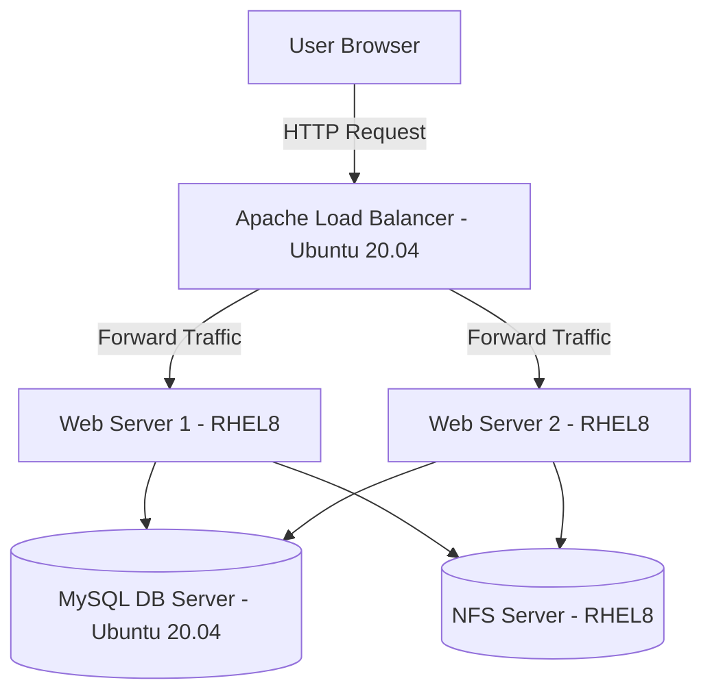

---

# 🧾 Load Balancer Solution with Apache

## 📘 Table of Contents

1. [Project Overview](#project-overview)
2. [Architecture Diagram](#architecture-diagram)
3. [Concepts Covered](#concepts-covered)
4. [Project Setup](#project-setup)
5. [Step-by-Step Implementation](#step-by-step-implementation)
6. [Verification & Testing](#verification--testing)
7. [Optional Configuration (Local DNS)](#optional-configuration-local-dns)
8. [Troubleshooting Tips](#troubleshooting-tips)
9. [Project Summary](#project-summary)

---

## 🧠 Project Overview

This project demonstrates how to set up **horizontal scaling** in a web architecture using an **Apache Load Balancer**.

Instead of users accessing multiple web servers individually (e.g., WebServer1, WebServer2), the **Load Balancer** provides a **single point of access** and evenly distributes traffic among backend web servers. This improves **scalability, fault tolerance, and performance**.

**Goal:**
Deploy and configure an Apache Load Balancer on an Ubuntu EC2 instance that distributes traffic between two RHEL8 web servers hosting a tooling website.

---

## 🏗️ Architecture Diagram



**Key Components:**

* **Load Balancer (Apache):** Distributes client requests between web servers.
* **Web Servers (RHEL8):** Serve the application (tooling website).
* **Database Server:** Stores data for the application.
* **NFS Server:** Provides shared storage between the web servers.

---

## 📚 Concepts Covered

| Concept                       | Description                                                                     |
| ----------------------------- | ------------------------------------------------------------------------------- |
| **Load Balancing**            | Technique to distribute network or application traffic across multiple servers. |
| **Horizontal Scaling**        | Adding more servers to handle increased traffic.                                |
| **Vertical Scaling**          | Increasing server capacity (CPU, RAM).                                          |
| **L7 Load Balancer**          | Operates at the application layer (HTTP, HTTPS).                                |
| **Apache mod_proxy_balancer** | Apache module used for reverse proxy and load balancing.                        |

---

## ⚙️ Project Setup

| Server                  | OS           | Role        | Description                                            |
| ----------------------- | ------------ | ----------- | ------------------------------------------------------ |
| WebServer1              | RHEL8        | Application | Hosts tooling website                                  |
| WebServer2              | RHEL8        | Application | Hosts tooling website                                  |
| DB Server               | Ubuntu 20.04 | Database    | Hosts MySQL                                            |
| NFS Server              | RHEL8        | Storage     | Provides shared files for web servers                  |
| **Load Balancer (NEW)** | Ubuntu 20.04 | Apache LB   | Distributes requests between WebServer1 and WebServer2 |

---

## 🧩 Step-by-Step Implementation

### **Step 1 — Verify Existing Web Servers**

Ensure both RHEL8 web servers are running and accessible via:

```
http://<WebServer1_Public_IP>/index.php
http://<WebServer2_Public_IP>/index.php
```

✅ Expected: Both should display the same tooling website.

`Step1_WebServers_Working.png`


---

### **Step 2 — Launch Ubuntu EC2 for Load Balancer**

* **Name:** `Project-8-apache-lb`
* **AMI:** Ubuntu Server 20.04 LTS
* **Type:** t2.micro
* **Security Group:** Allow inbound traffic for:

  * SSH (22)
  * HTTP (80)


---

### **Step 3 — Open Port 80**

Add inbound rule for HTTP (port 80) in the LB security group.

---

### **Step 4 — Connect to the Load Balancer**

```bash
ssh -i "your-key.pem" ubuntu@<LB-Public-IP>
```

---

### **Step 5 — Install Apache**

```bash
sudo apt update
sudo apt install apache2 -y
sudo apt-get install libxml2-dev -y
```

---

### **Step 6 — Enable Required Apache Modules**

```bash
sudo a2enmod rewrite
sudo a2enmod proxy
sudo a2enmod proxy_balancer
sudo a2enmod proxy_http
sudo a2enmod headers
sudo a2enmod lbmethod_bytraffic
sudo systemctl restart apache2
sudo systemctl status apache2
```

---

### **Step 7 — Configure Load Balancer**

Edit Apache configuration:

```bash
sudo vi /etc/apache2/sites-available/000-default.conf
```

Inside `<VirtualHost *:80>` block, add:

```apache
<Proxy "balancer://mycluster">
    BalancerMember http://<WebServer1-Private-IP>:80 loadfactor=5 timeout=1
    BalancerMember http://<WebServer2-Private-IP>:80 loadfactor=5 timeout=1
    ProxySet lbmethod=bytraffic
</Proxy>

ProxyPreserveHost On
ProxyPass / balancer://mycluster/
ProxyPassReverse / balancer://mycluster/
```

Save and exit (`:wq`).

---

### **Step 8 — Restart Apache**

```bash
sudo systemctl restart apache2
sudo systemctl status apache2
```

---

## 🧪 Verification & Testing

### **Step 9 — Access Website via Load Balancer**

In your browser:

```
http://<LB-Public-IP>/index.php
```

✅ Expected: Tooling website loads successfully.

`Step9_LB_Webpage_Loaded.png`


---

### **Step 10 — Confirm Load Distribution**

SSH into both web servers:

```bash
ssh -i "your-key.pem" ec2-user@<WebServer1-Public-IP>
ssh -i "your-key.pem" ec2-user@<WebServer2-Public-IP>
```

Run:

```bash
sudo tail -f /var/log/httpd/access_log
```

`Step10_Load_Distribution_Verified.png`


---

## 🧭 Optional Configuration (Local DNS)

You can add hostnames for your web servers on the LB:

```bash
sudo vi /etc/hosts
```

Add:

```
<WebServer1-Private-IP> Web1
<WebServer2-Private-IP> Web2
```

Then update your Apache config to use:

```apache
BalancerMember http://Web1:80
BalancerMember http://Web2:80
```

Test:

```bash
curl http://Web1
curl http://Web2
```
`Step11_LocalDNS_Configured.png`


---

## 🩺 Troubleshooting Tips

| Issue                            | Possible Cause             | Fix                              |
| -------------------------------- | -------------------------- | -------------------------------- |
| Website not loading              | Apache not running         | `sudo systemctl restart apache2` |
| Only one server getting requests | Wrong private IPs          | Verify IPs in config file        |
| Curl fails to reach Web1/Web2    | Missing /etc/hosts entries | Re-add mappings                  |
| Browser shows 403 or 404         | Wrong document root        | Check web server paths           |

---

## 🧾 Project Summary

✅ Deployed Apache as a **Load Balancer** on Ubuntu 20.04

✅ Connected it to **two RHEL8 web servers**

✅ Verified **traffic distribution** using Apache `mod_proxy_balancer`

✅ Enhanced scalability and reliability

✅ Demonstrated **horizontal scaling** architecture in practice


This project illustrates one of the **core DevOps principles — scalability**.
By implementing a Load Balancer, I ensured that no single web server was overwhelmed by improving both **performance** and **fault tolerance**.
---

---
**Author:** Vivian Chiamaka Okose ✨
---