---

# 📄 **Nginx Load Balancer with SSL/TLS (DuckDNS + Certbot Project)**

## 🚀 Nginx Load Balancer with SSL/TLS Encryption

**A DevOps Project by Vivian Chiamaka Okose**

This project demonstrates a complete end-to-end setup of a **Highly Available Web Architecture** using:

* **Nginx Load Balancer**
* **Two Apache Web Servers**
* **DuckDNS Free Domain**
* **Let’s Encrypt SSL/TLS using Certbot**
* **Automatic Certificate Renewal**
* **EC2 Ubuntu Linux Infrastructure**

---

# 🧱 **Architecture Diagram**

```
                 HTTPS / HTTP Traffic
                        │
                        ▼
           ┌────────────────────────────┐
           │     NGINX LOAD BALANCER    │
           │    (52.3.27.50 / HTTPS)    │
           └────────────────────────────┘
                 │                 │
         ┌─────────────┐      ┌─────────────┐
         │   Web1      │      │   Web2      │
         │ Apache2+HTML│      │ Apache2+HTML│
         └─────────────┘      └─────────────┘
```

---

# 🎯 **Project Goals**

✔ Configure two backend web servers with sample pages
✔ Configure Nginx as a load balancer (Round Robin)
✔ Register free domain using DuckDNS
✔ Point domain → Elastic IP
✔ Enable HTTPS using Let’s Encrypt
✔ Set up automatic SSL renewal
✔ Validate secure access to the application

---

# 🖥️ **Technologies Used**

* **AWS EC2 (Ubuntu 20.04 LTS)**
* **Nginx**
* **Apache2**
* **DuckDNS**
* **Certbot (Let’s Encrypt)**
* **Cron Jobs**
* **Linux Bash**
* **Systemd**

---

# ⚙️ **Configuration Overview**

## 1️⃣ Update `/etc/hosts` on Load Balancer

```
sudo nano /etc/hosts
```

Add:

```
<private-ip-web1>  Web1
<private-ip-web2>  Web2
```

---

## 2️⃣ Configure Nginx Load Balancer

Edit:

```
sudo nano /etc/nginx/nginx.conf
```

Inside **http {}** add:

```
upstream myproject {
   server Web1 weight=5;
   server Web2 weight=5;
}
```

Then set server block:

```
server {
    listen 80;
    server_name crystaldevops.duckdns.org;

    location / {
        proxy_pass http://myproject;
        proxy_set_header Host $host;
        proxy_set_header X-Real-IP $remote_addr;
        proxy_set_header X-Forwarded-For $proxy_add_x_forwarded_for;
    }
}
```

Restart:

```
sudo systemctl restart nginx
sudo systemctl status nginx
```

---

## 3️⃣ Domain Setup (DuckDNS)

* Create domain: **viviandevops.duckdns.org**
* Set IP to Elastic IP: **52.3.27.50**

---

## 4️⃣ Install Certbot (SSL/TLS)

```
sudo snap install --classic certbot
sudo ln -s /snap/bin/certbot /usr/bin/certbot
sudo certbot --nginx -d viviandevops.duckdns.org
```

Renewal test:

```
sudo certbot renew --dry-run
```

Cron Job:

```
sudo crontab -e
```

Add:

```
* */12 * * *   root /usr/bin/certbot renew > /dev/null 2>&1
```

---

# 🌐 **Final Result**

My website is accessible securely at:

👉 **[https://viviandevops.duckdns.org](https://viviandevops.duckdns.org)**
(With automatic load balancing + HTTPS)

---

# 📸 Screenshot Checklist (As Required in Assignment)

1. EC2 Instance List


2. Security Groups

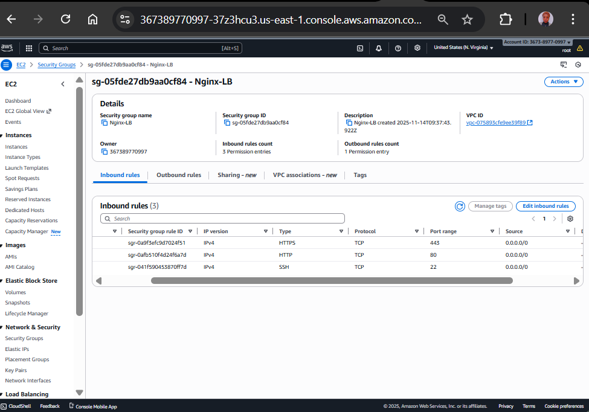

3. Elastic IP

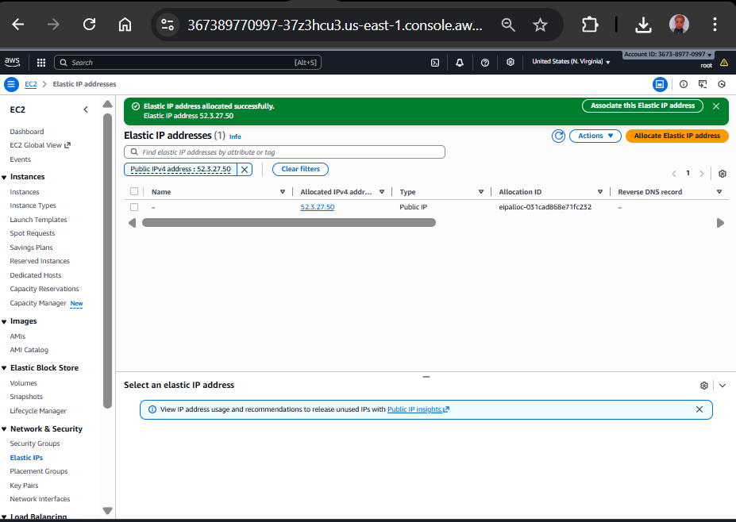

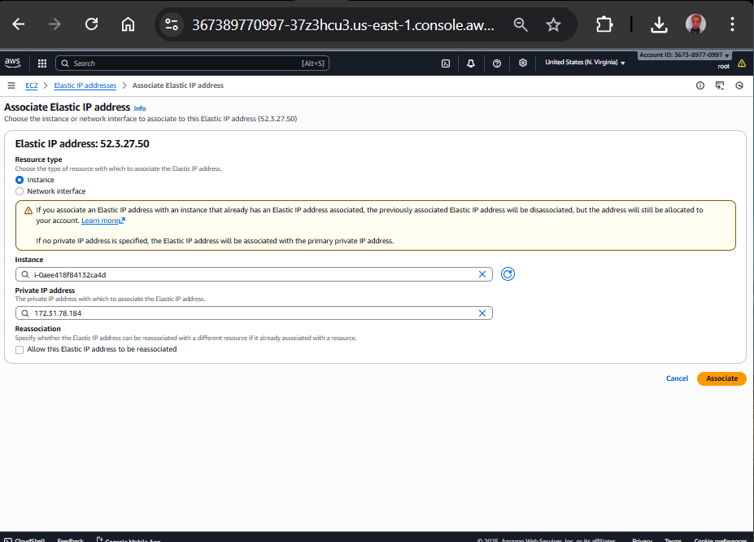


4. /etc/hosts file

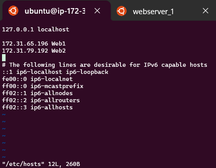


5. Web server test pages

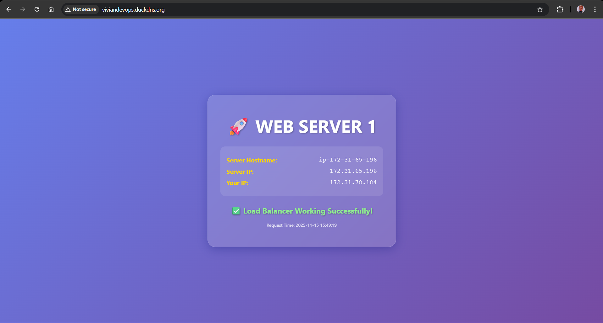

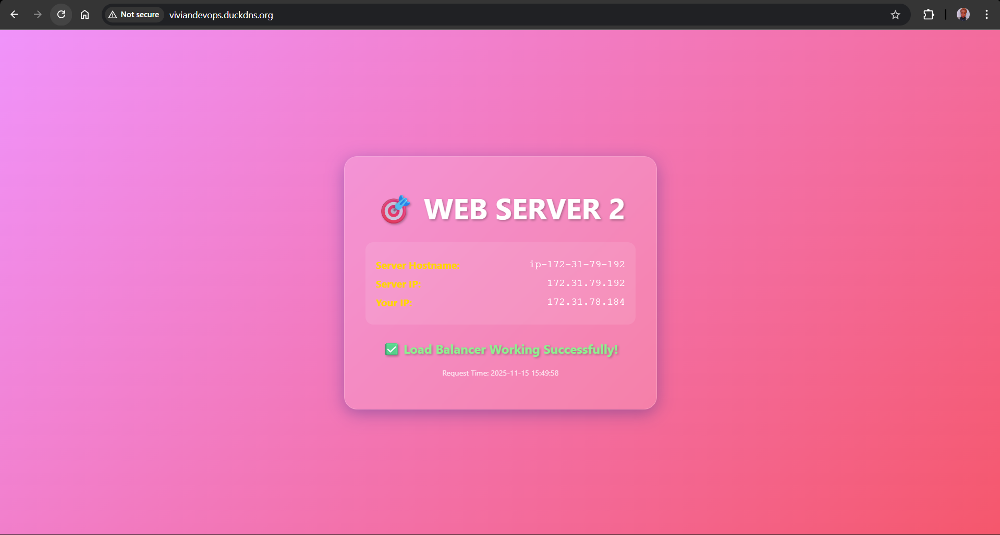


6. Nginx configuration

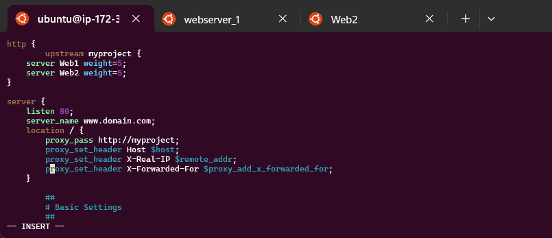


7. DuckDNS domain dashboard

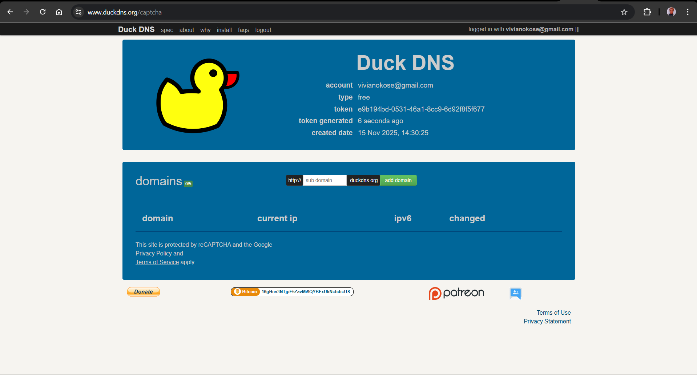

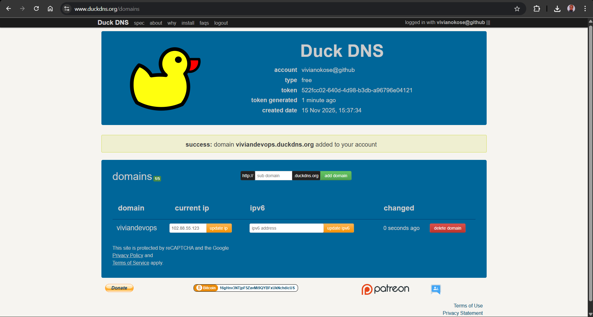

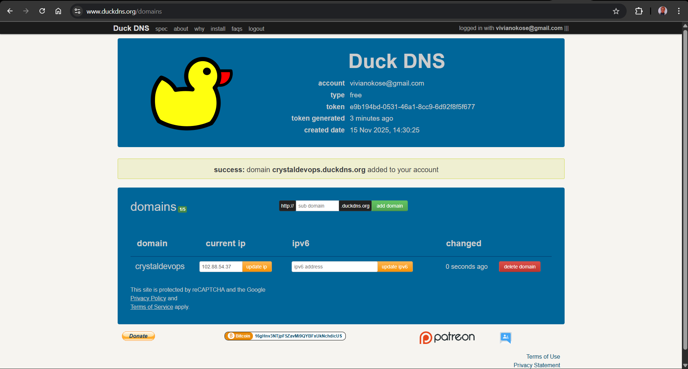


8. Certbot SSL issuance

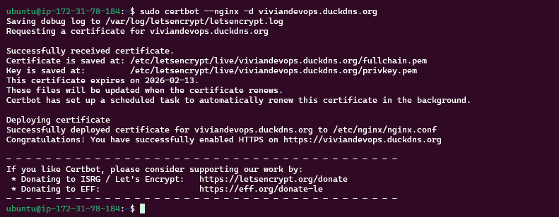


9. HTTPS access test

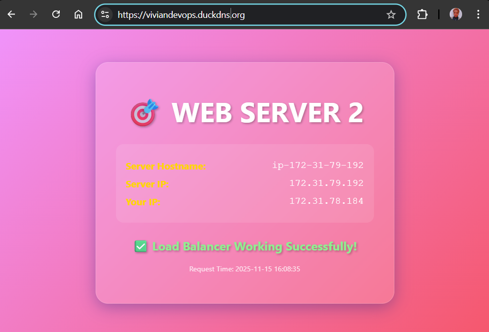


10. Cron job for SSL renewal

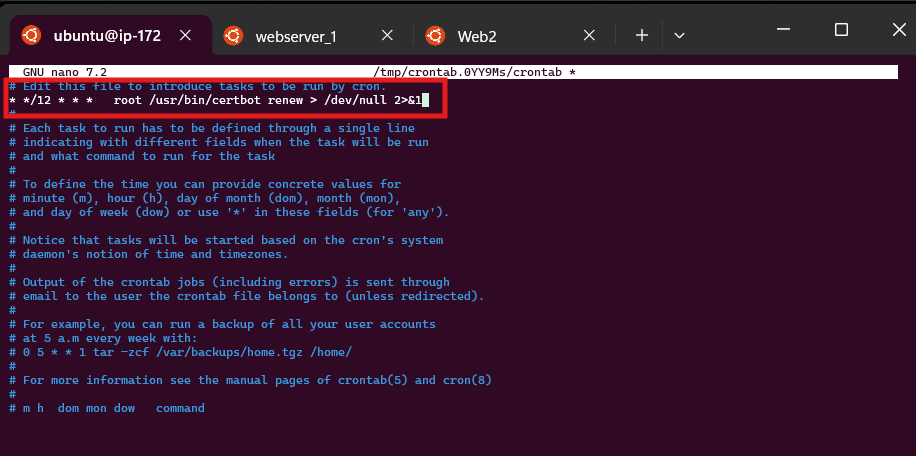


---

# 🏁 **Conclusion**

This project demonstrates DevOps fundamentals:

✔ Infrastructure setup
✔ Networking concepts
✔ Domain configuration
✔ SSL security
✔ Automation
✔ Load balancing
✔ Linux server administration

---

# ⭐ Author

**Vivian Chiamaka Okose**
DevOps & Cloud Engineering Student | StegHub Scholar
GitHub: *[Vivian Okose](https://github.com/vivianokose)*
LinkedIn: *[Vivian Chiamaka Okose](https://www.linkedin.com/in/okosechiamaka/)*

---